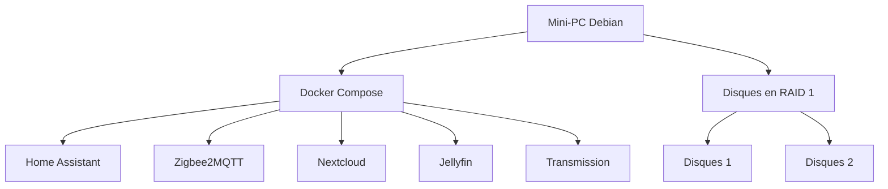

# Le Cube

## Présentation

Le but de ce projet est de centraliser un NAS et un système domotique dans un seul mini-PC.

### Matériel

Pour ce projet, je prévois d'utiliser :

- un mini-PC
- 2 disques durs
- une clé Zigbee

### Logiciel

Voici les choix retenus :

- Système d'exploitation : Debian sans interface graphique
- Virtualisation des applications : Docker Compose
- Domotique : Home Assistant
- Protocole des objets connectés : Zigbee, géré par Zigbee2MQTT
- Gestion des fichiers : Nextcloud
- Réplication des données : mdadm en RAID 1
- Gestion des médias : Jellyfin
- Téléchargement de torrents : Transmission

Voici un schéma simple de l'architecture du projet :



## Installation de l'OS

1. Télécharger l'image ISO de Debian stable depuis <https://debian.obspm.fr/debian-cd/13.5.0/amd64/iso-cd/>
2. Créer une clé USB bootable avec l'ISO en utilisant le logiciel de votre choix
3. Brancher la clé USB au mini-PC et démarrer dessus.
4. Dans le menu d'installation,"Graphical Install", puis suivre les étapes d'installation

> Note : Attention à installer le système minimal sans environnement graphique, dans les tâches d'installation : décocher les environnements de bureau, cocher "SSH server"

### Cloner le projet

Afin de récupérer les scripts d'installation il faut cloner le projet.
Pour commencer créer une clé ssh et l'importer dans github. 
Commande pour créer une clé ssh : 

```shell
# Ajouter la commande sudo
su root
apt install sudo
/usr/sbin/usermod -aG sudo lecube
exit

# Installer git
sudo apt install git

# Génerer la clé ssh
ssh-keygen -t ed25519 -C "lecube"
cat ~/.ssh/id_ed25519.pub

# Cloner le projet
git clone git@github.com:qledelas/home-jarvis.git
```

## Réplication des disques

> Attention : cette opération efface les données présentes sur les disques sélectionnés. Vérifier soigneusement les noms des périphériques avant de continuer.

1. Brancher les 2 disques durs en USB au mini-PC.
2. Vérifier leurs noms sous Linux :
   ```bash
   lsblk -o NAME,SIZE,MODEL,TRAN
   ```
   Repérer les deux disques, par exemple `/dev/sdb` et `/dev/sdc`.
3. Exécuter le script fourni pour installer `mdadm` et créer un RAID 1 :
   ```bash
   sudo ./scripts/install-mdadm-raid1.sh /dev/sdb /dev/sdc
   ```
4. Le script réalise automatiquement les étapes suivantes :
   - installation de `mdadm` et `parted`
   - création d’une partition GPT sur chaque disque
   - création du RAID 1 `/dev/md0`
   - formatage en `ext4`
   - montage sur `/mnt/raid1`
   - ajout de la configuration au démarrage dans `/etc/fstab`

Pour vérifier que le RAID fonctionne correctement, on peut utiliser :
```bash
sudo mdadm --detail /dev/md0
```

## Installation des applications

Dans le dossier home faire un git clone.

Pour installer Docker et Docker Compose sur Debian, exécuter le script suivant :
```bash
sudo ./scripts/install-docker-debian.sh
```

Le script installe Docker Engine, Docker Compose (plugin), active le service et ajoute l’utilisateur courant au groupe docker.

### Media

Cette section permet de démarrer l’infrastructure de téléchargement et de lecture de médias. Elle repose sur plusieurs services complémentaires : Transmission pour les torrents, Sonarr pour les séries, Radarr pour les films, Prowlarr pour les indexeurs (sites de torrents) et Seerr pour la demande de contenus. Jellyfin sert ensuite de lecteur multimédia pour lire ce qui a été récupéré.

#### Comment ça fonctionne

Le fonctionnement est le suivant :

1. Seerr permet de demander un film ou une série depuis une interface web simple.
2. Les demandes sont envoyées vers Sonarr ou Radarr selon le type de média.
3. Sonarr et Radarr utilisent Prowlarr pour trouver des indexeurs et des sources de recherche fiables.
4. Les fichiers sont téléchargés par Transmission.
5. Une fois le téléchargement terminé, Sonarr ou Radarr importent les fichiers dans le dossier de médiathèque.
6. Jellyfin scanne automatiquement cette médiathèque et permet de lire les contenus depuis un navigateur ou une application compatible.

En pratique, cela forme un pipeline complet : demande -> recherche -> téléchargement -> import -> lecture.

#### URLs et ports par défaut

Comme les containers utilisent le mode réseau host, les services sont accessibles directement sur l’IP du serveur avec les ports suivants :

- Transmission : http://<ton-ip>:9091 ou <https://transmission.example.myaddr.io>
- Jellyfin : http://<ton-ip>:8096 ou <https://media.example.myaddr.io>
- Sonarr : http://<ton-ip>:8989
- Radarr : http://<ton-ip>:7878
- Prowlarr : http://<ton-ip>:9696
- Seerr : http://<ton-ip>:5055 ou <https://seer.example.myaddr.io>

#### Configuration minimale à faire lors de la première installation

1. Dupliquer le fichier d’environnement et renseigner les valeurs nécessaires :

```bash
cp .env.example .env
```

2. Vérifier que les variables importantes sont bien définies dans le fichier .env, notamment :
   - `TRANSMISSION_PASS`
   - `ID`
   - `GID`

3. Démarrer la stack media :

```bash
docker compose up --profile media -d
```

4. Configurations recommandées au premier lancement :
   - Transmission : connecter l’interface avec l’utilisateur `transmission` et le mot de passe défini dans `.env`.
   - Sonarr : configuer le dossier /data/media/tv en root folder, configurer Transmission comme client de téléchargement, puis connecter Sonarr à Prowlarr.
   - Radarr : configuer le dossier /data/media/movie en root folder dans media management, configurer Transmission comme client de téléchargement, puis connecter Radarr à Prowlarr.
   - Prowlarr : ajouter au moins un indexeur et lier Sonarr et Radarr à cet outil. 
   - Seerr : créer le premier compte administrateur, puis configurer les connexions vers Sonarr et Radarr avec leurs clés API.
   - Jellyfin : créer le compte administrateur initial, puis ajouter une bibliothèque film vers /media/movie et une bibliothèque serie vers /media/tv.

Une fois ces étapes réalisées, le système est prêt à télécharger, trier et lire vos films et séries automatiquement.

### Domotique

Cette section permet de démarrer les outils nécessaire gérer votre domotique avec Homeassistant des appareils zigbee

Récupérer l'id de votre dongle zigbee pour modifier le fichier docker-compose.yml avec la bonne valeur. 
```bash
ls /dev/serial/by-id/
```

Ensuite démarré la stack :

```bash
docker compose up --profile domotique -d
```

Liste des urls accessible : 
   - homeassistant : <tonip:8123>
   - zigbeetomqtt : <tonip:8080>

Il suffit de se rendre dans l'interface de zigbeetomqtt pour cliquer sur "Autoriser l'appairage" afin d'ajouter de nouveaux apparails.

### Public

Afin de pouvoir utiliser google assistant, il faut que votre homeassistant soit disponible en https.

La premiere étape est de créer un nom de domaie gratuit qui renvoie vers l'IP de votre box.
Pour cela je recommande https://myaddr.tools/ pour créer votre nom de domaine example.myaddr.io.
Renseigner ensuite votre domaine et la clé dans caddy/ddns-updater/config.json

Un container ddns va s'occuper pour vous de récupérer votre ip public et faire l'enregistrement DNS.
Le refresh est fais toute les heures. 

Il vous faudra configurer votre box pour définir une IP fix à votre miniPC ( section DHCP) et rediriger certain port vers votre miniPC ( section NAT )

Ensuite nous utilisons le reverse proxy caddy pour rediriger vers le bon service en fonction du sous nom de domaine.

Modifier dans Caddifile et dans configuration.yml de HA l'url par votre nom de domaine.

Ensuite démarré la stack :

```bash
docker compose up --profile public -d
```

Liste des urls accessible : 
   - homeassistant : <https://home.example..myaddr.io>

### Consommation électrique

Pour récupérer ma consommation dans homeassistant j'utilise <https://github.com/bokub/ha-linky>

Il faut dans HA aller dans /profile/security et créer un jeton d'accès à stoker dans le fichier .env pour la clé SUPERVISOR_TOKEN.
Il faut également completer le fichier ha-linky/options.json avec le `prm` et le `token` récupérable à l'adresse suivante : <https://conso.boris.sh>
Il faut également renseigner votre prix au Kwh. 

Commande à lancer
```shell
docker build https://github.com/bokub/ha-linky.git -f standalone.Dockerfile -t ha-linky
docker compose --profile linky up -d
```

### NAS

Afin d'avoir un drive maison j'utilise l'application nextcloud. Elle fournie une image docker tous compris : <https://github.com/nextcloud/all-in-one/blob/main/compose.yaml>

Renseigner le nom de domaine dans le fichier caddy.

Lancer le container :
```shell
docker compose up -d nextcloud
```

Il faut ensuite lancer la configuration en accédant au domaine temporaire initcloud.example.myaddr.io
Une fois la configuration terminé vous pourrez accéder via cloud.example.myaddr.io

# Next step

NAS: 
- installer nextcloud avec le bon dossier répliqué
- Faire le readme pour la connection à google home