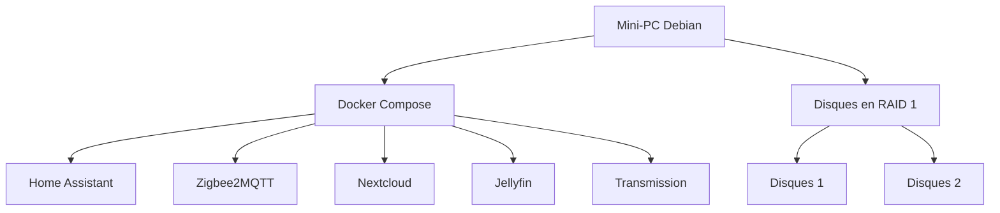

# Le Cube

## Présentation

Le but de ce projet est de centraliser un NAS et un système domotique dans un seul mini-PC.

### Matériel

Pour ce projet, je prévois d'utiliser :

- un mini-PC
- 2 disques durs
- une clé Zigbee

### Logiciel

Voici les choix retenus :

- Système d'exploitation : Debian sans interface graphique
- Virtualisation des applications : Docker Compose
- Domotique : Home Assistant
- Protocole des objets connectés : Zigbee, géré par Zigbee2MQTT
- Gestion des fichiers : Nextcloud
- Réplication des données : mdadm en RAID 1
- Gestion des médias : Jellyfin
- Téléchargement de torrents : Transmission

Voici un schéma simple de l'architecture du projet :



## Installation de l'OS

1. Télécharger l'image ISO de Debian stable depuis <https://debian.obspm.fr/debian-cd/13.5.0/amd64/iso-cd/>
2. Créer une clé USB bootable avec l'ISO en utilisant le logiciel de votre choix
3. Brancher la clé USB au mini-PC et démarrer dessus.
4. Dans le menu d'installation,"Graphical Install", puis suivre les étapes d'installation

> Note : Attention à installer le système minimal sans environnement graphique, dans les tâches d'installation : décocher les environnements de bureau, cocher "SSH server"

### Cloner le projet

Afin de récupérer les scripts d'installation il faut cloner le projet.
Pour commencer créer une clé ssh et l'importer dans github. 
Commande pour créer une clé ssh : 

```shell
# Ajouter la commande sudo
su root
apt install sudo
/usr/sbin/usermod -aG sudo lecube
exit

# Installer git
sudo apt install git

# Génerer la clé ssh
ssh-keygen -t ed25519 -C "lecube"
cat ~/.ssh/id_ed25519.pub

# Cloner le projet
git clone git@github.com:qledelas/home-jarvis.git
```

## Réplication des disques

> Attention : cette opération efface les données présentes sur les disques sélectionnés. Vérifier soigneusement les noms des périphériques avant de continuer.

1. Brancher les 2 disques durs en USB au mini-PC.
2. Vérifier leurs noms sous Linux :
   ```bash
   lsblk -o NAME,SIZE,MODEL,TRAN
   ```
   Repérer les deux disques, par exemple `/dev/sdb` et `/dev/sdc`.
3. Exécuter le script fourni pour installer `mdadm` et créer un RAID 1 :
   ```bash
   sudo ./scripts/install-mdadm-raid1.sh /dev/sdb /dev/sdc
   ```
4. Le script réalise automatiquement les étapes suivantes :
   - installation de `mdadm` et `parted`
   - création d’une partition GPT sur chaque disque
   - création du RAID 1 `/dev/md0`
   - formatage en `ext4`
   - montage sur `/mnt/raid1`
   - ajout de la configuration au démarrage dans `/etc/fstab`

Pour vérifier que le RAID fonctionne correctement, on peut utiliser :
```bash
sudo mdadm --detail /dev/md0
```

## Installation des applications

Dans le dossier home faire un git clone.

Pour installer Docker et Docker Compose sur Debian, exécuter le script suivant :
```bash
sudo ./scripts/install-docker-debian.sh
```

Le script installe Docker Engine, Docker Compose (plugin), active le service et ajoute l’utilisateur courant au groupe docker.

Récupérer l'id de votre dongle zigbee pour modifier le fichier docker-compose.yml avec la bonne valeur. 
```bash
ls /dev/serial/by-id/
```

Dupliquer le fichier .env.example et remplire les valeurs
```bash
cp .env.example .env
```

Ensuite démarré la stack :

```bash
docker compose up -d
```

Liste des urls accessible : 
   - homeassistant : <tonip:8123>
   - zigbeetomqtt : <tonip:8123>
   - transmission : <tonip:9091>
   - jellyfin : <tonip:8096>

# Next step 

Domotique :
- Reprendre la configuration swag pour un accès externe
- Reprendre la configuration googleHome
- importer ma config zigbee existante
NAS :
- ajouter nextcloud dans docker compose