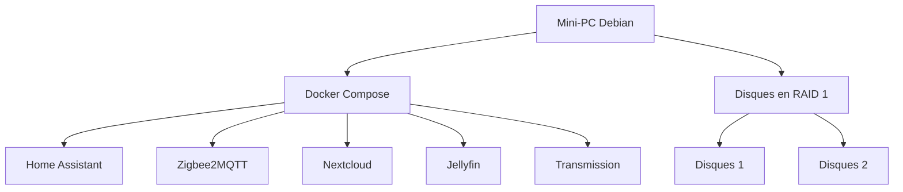

# Le Cube

## Présentation

Le but de ce projet est de centraliser un NAS et un système domotique dans un seul mini-PC.

### Matériel

Pour ce projet, je prévois d'utiliser :

- un mini-PC
- 2 disques durs
- une clé Zigbee

### Logiciel

Voici les choix retenus :

- Système d'exploitation : Debian sans interface graphique
- Virtualisation des applications : Docker Compose
- Domotique : Home Assistant
- Protocole des objets connectés : Zigbee, géré par Zigbee2MQTT
- Gestion des fichiers : Nextcloud
- Réplication des données : mdadm en RAID 1
- Gestion des médias : Jellyfin
- Téléchargement de torrents : Transmission

Voici un schéma simple de l'architecture du projet :



## Installation de l'OS

1. Télécharger l'image ISO de Debian stable depuis https://www.debian.org/distrib/
2. Créer une clé USB bootable avec l'ISO :
   - Sur Linux : `sudo dd if=debian-XX.X.X-amd64-netinst.iso of=/dev/sdX bs=4M status=progress && sync`
   - Sur Windows : utiliser Rufus et sélectionner l'ISO Debian
3. Brancher la clé USB au mini-PC et démarrer dessus.
4. Dans le menu d'installation, choisir "Install" ou "Graphical Install" si l'option est proposée, puis sélectionner "Français".
5. Configurer le clavier, le réseau et le nom de la machine.
6. Lors de la configuration du réseau :
   - choisir une adresse IPv4 statique ou DHCP selon les besoins
   - activer l'interface réseau
7. Installer le système minimal sans environnement graphique :
   - sélectionner "Install" ou "Expert install"
   - dans les tâches d'installation, décocher les environnements de bureau
   - cocher uniquement "SSH server" pour activer SSH
8. Terminer l'installation, retirer la clé USB puis redémarrer.
9. Se connecter en SSH depuis un autre poste : `ssh utilisateur@adresse_ip`

> Note : si l'option "SSH server" n'apparaît pas, installer openssh-server après le premier démarrage avec la commande : `sudo apt update && sudo apt install openssh-server`.

## Réplication des disques

> Attention : cette opération efface les données présentes sur les disques sélectionnés. Vérifier soigneusement les noms des périphériques avant de continuer.

1. Brancher les 2 disques durs en USB au mini-PC.
2. Vérifier leurs noms sous Linux :
   ```bash
   lsblk -o NAME,SIZE,MODEL,TRAN
   ```
   Repérer les deux disques, par exemple `/dev/sdb` et `/dev/sdc`.
3. Exécuter le script fourni pour installer `mdadm` et créer un RAID 1 :
   ```bash
   sudo ./scripts/install-mdadm-raid1.sh /dev/sdb /dev/sdc
   ```
4. Le script réalise automatiquement les étapes suivantes :
   - installation de `mdadm` et `parted`
   - création d’une partition GPT sur chaque disque
   - création du RAID 1 `/dev/md0`
   - formatage en `ext4`
   - montage sur `/mnt/raid1`
   - ajout de la configuration au démarrage dans `/etc/fstab`
5. Vérifier l’état du RAID :
   ```bash
   cat /proc/mdstat
   sudo mdadm --detail /dev/md0
   ```

Pour vérifier que le RAID fonctionne correctement, on peut utiliser :
```bash
sudo mdadm --detail /dev/md0
```

## Installation des applications

Dans le dossier home faire un git clone.

Pour installer Docker et Docker Compose sur Debian, exécuter le script suivant :
```bash
sudo ./scripts/install-docker-debian.sh
```

Le script installe Docker Engine, Docker Compose (plugin), active le service et ajoute l’utilisateur courant au groupe docker.

Récupérer l'id de votre dongle zigbee pour modifier le fichier docker-compose.yml avec la bonne valeur. 
```bash
ls /dev/serial/by-id/
```

Ensuite démarré la stack :

```bash
docker compose up -d
```

Accéder à <http://localhost:8123/> 