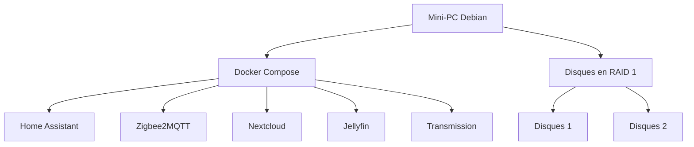

# Le Cube

## Présentation

Le but de ce projet est de centraliser un NAS et un système domotique dans un seul mini-PC.

### Matériel

Pour ce projet, je prévois d'utiliser :

- un mini-PC
- 2 disques durs
- une clé Zigbee

### Logiciel

Voici les choix retenus :

- Système d'exploitation : Debian sans interface graphique
- Virtualisation des applications : Docker Compose
- Domotique : Home Assistant
- Protocole des objets connectés : Zigbee, géré par Zigbee2MQTT
- Gestion des fichiers : Nextcloud
- Réplication des données : mdadm en RAID 1
- Gestion des médias : Jellyfin
- Téléchargement de torrents : Transmission

Voici un schéma simple de l'architecture du projet :



## Installation de l'OS

1. Télécharger l'image ISO de Debian stable depuis <https://debian.obspm.fr/debian-cd/13.5.0/amd64/iso-cd/>
2. Créer une clé USB bootable avec l'ISO en utilisant le logiciel de votre choix
3. Brancher la clé USB au mini-PC et démarrer dessus.
4. Dans le menu d'installation,"Graphical Install", puis suivre les étapes d'installation

> Note : Attention à installer le système minimal sans environnement graphique, dans les tâches d'installation : décocher les environnements de bureau, cocher "SSH server"

### Cloner le projet

Afin de récupérer les scripts d'installation il faut cloner le projet.
Pour commencer créer une clé ssh et l'importer dans github. 
Commande pour créer une clé ssh : 

```shell
# Ajouter la commande sudo
su root
apt install sudo
/usr/sbin/usermod -aG sudo lecube
exit

# Installer git
sudo apt install git

# Génerer la clé ssh
ssh-keygen -t ed25519 -C "lecube"
cat ~/.ssh/id_ed25519.pub

# Cloner le projet
git clone git@github.com:qledelas/home-jarvis.git
```

## Réplication des disques

> Attention : cette opération efface les données présentes sur les disques sélectionnés. Vérifier soigneusement les noms des périphériques avant de continuer.

1. Brancher les 2 disques durs en USB au mini-PC.
2. Vérifier leurs noms sous Linux :
   ```bash
   lsblk -o NAME,SIZE,MODEL,TRAN
   ```
   Repérer les deux disques, par exemple `/dev/sdb` et `/dev/sdc`.
3. Exécuter le script fourni pour installer `mdadm` et créer un RAID 1 :
   ```bash
   sudo ./scripts/install-mdadm-raid1.sh /dev/sdb /dev/sdc
   ```
4. Le script réalise automatiquement les étapes suivantes :
   - installation de `mdadm` et `parted`
   - création d’une partition GPT sur chaque disque
   - création du RAID 1 `/dev/md0`
   - formatage en `ext4`
   - montage sur `/mnt/raid1`
   - ajout de la configuration au démarrage dans `/etc/fstab`

Pour vérifier que le RAID fonctionne correctement, on peut utiliser :
```bash
sudo mdadm --detail /dev/md0
```

## Installation des applications

Dans le dossier home faire un git clone.

Pour installer Docker et Docker Compose sur Debian, exécuter le script suivant :
```bash
sudo ./scripts/install-docker-debian.sh
```

Le script installe Docker Engine, Docker Compose (plugin), active le service et ajoute l’utilisateur courant au groupe docker.

### Media

Cette section permet de démarrer les outils nécessaire pour télécharger des médias et les lires grâce à transmission et jellyfin.

Dupliquer le fichier .env.example et remplire les valeurs
```bash
cp .env.example .env
```

Ensuite démarré la stack :

```bash
docker compose up --profile media -d
```

Liste des urls accessible : 
   - homeassistant : <tonip:8123>
   - zigbeetomqtt : <tonip:8080>
   - transmission : <tonip:9091>
   - jellyfin : <tonip:8096>


### Domotique

Cette section permet de démarrer les outils nécessaire gérer votre domotique avec Homeassistant des appareils zigbee

Récupérer l'id de votre dongle zigbee pour modifier le fichier docker-compose.yml avec la bonne valeur. 
```bash
ls /dev/serial/by-id/
```

Ensuite démarré la stack :

```bash
docker compose up --profile domotique -d
```

Liste des urls accessible : 
   - homeassistant : <tonip:8123>
   - zigbeetomqtt : <tonip:8080>

Il suffit de se rendre dans l'interface de zigbeetomqtt pour cliquer sur "Autoriser l'appairage" afin d'ajouter de nouveaux apparails.

### Public

Afin de pouvoir utiliser google assistant, il faut que votre homeassistant soit disponible en https.

La premiere étape est de créer un nom de domaie gratuit qui renvoie vers l'IP de votre box.
Pour cela je recommande https://myaddr.tools/ pour créer votre nom de domaine example.myaddr.io.
Renseigner ensuite votre domaine et la clé dans caddy/ddns-updater/config.json

Un container ddns va s'occuper pour vous de récupérer votre ip public et faire l'enregistrement DNS.
Le refresh est fais toute les heures. 

Il vous faudra configurer votre box pour définir une IP fix à votre miniPC ( section DHCP) et rediriger certain port vers votre miniPC ( section NAT )

Ensuite nous utilisons le reverse proxy caddy pour rediriger vers le bon service en fonction du sous nom de domaine.

Modifier dans Caddifile et dans configuration.yml de HA l'url par votre nom de domaine.

Ensuite démarré la stack :

```bash
docker compose up --profile public -d
```

Liste des urls accessible : 
   - homeassistant : <https://home.example..myaddr.io>

### Consommation électrique

Pour récupérer ma consommation dans homeassistant j'utilise <https://github.com/bokub/ha-linky>

Il faut dans HA aller dans /profile/security et créer un jeton d'accès à stoker dans le fichier .env pour la clé SUPERVISOR_TOKEN.
Il faut également completer le fichier ha-linky/options.json avec le `prm` et le `token` récupérable à l'adresse suivante : <https://conso.boris.sh>
Il faut également renseigner votre prix au Kwh. 

Commande à lancer
```shell
docker build https://github.com/bokub/ha-linky.git -f standalone.Dockerfile -t ha-linky
docker compose --profile linky up -d
```

### NAS

Afin d'avoir un drive maison j'utilise l'application nextcloud. Elle fournie une image docker tous compris : <https://github.com/nextcloud/all-in-one/blob/main/compose.yaml>

Renseigner le nom de domaine dans le fichier caddy. 

# Next step 

Domotique :
- Reprendre la configuration googleHome
Media: 
- tester l'application Jellifyn sur télé et en remote
- tester radaar, polaar, et tous ça